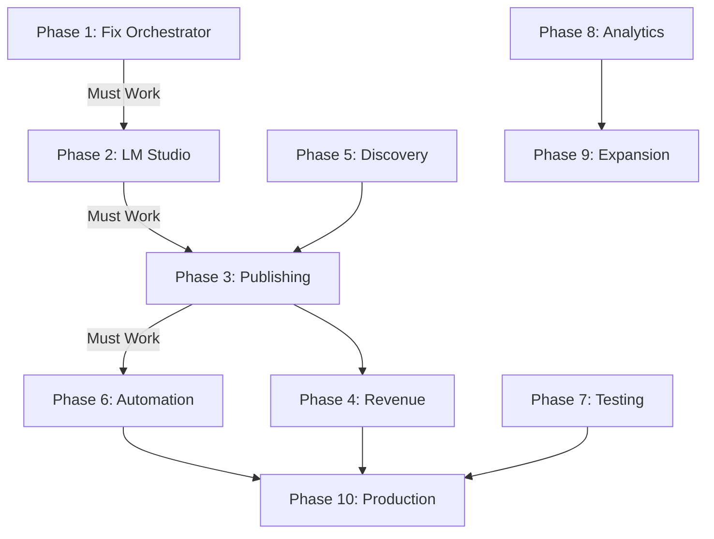

# OPUS-DLX Roadmap for Claude Code
**Date:** November 19, 2025  
**Architect:** Claude Opus 4.1  
**Philosophy:** Stop building wide, start building deep

---

## Strategic Pivot

**FROM:** 110 half-built modules across 6 revenue streams  
**TO:** 1 working revenue stream with 10 solid modules

**Chosen Path:** Content Generation → Blog Publishing → AdSense Revenue  
**Why:** Lowest barrier to entry, uses existing LM Studio infrastructure, can generate real revenue quickly

---

## Phase 1: Emergency Repairs (Session 1 - 800 lines)
**Goal:** Get the orchestrator to actually run  
**Timeline:** 2-3 hours  
**Priority:** CRITICAL - Nothing works until this is fixed

### Tasks:
1. **Fix module loading architecture** (200 lines)
   - Convert .ps1 files to proper .psm1 modules
   - Add Export-ModuleMember declarations
   - Create unified module loader
   
2. **Strip out all broken dependencies** (100 lines)
   - Comment out all Import-Module statements
   - Create stub functions for missing dependencies
   - Add fallback returns for all external calls

3. **Create minimal working orchestrator** (300 lines)
   ```powershell
   # Bare minimum that actually runs:
   function Start-MinimalOrchestrator {
       while ($true) {
           Write-Log "Orchestrator cycle started"
           
           # One thing that actually works
           $content = New-BlogPost -Topic (Get-TrendingTopic)
           Publish-BlogPost $content
           
           Start-Sleep -Seconds 3600
       }
   }
   ```

4. **Add basic error handling** (200 lines)
   - Wrap everything in try-catch
   - Log errors to file
   - Continue operation on failure

**Dependencies:** None  
**Risk:** High - May discover more broken dependencies  
**Success Metrics:** 
- ✅ master-orchestrator.ps1 loads without errors
- ✅ Can run for 1 minute without crashing
- ✅ Produces at least console output

---

## Phase 2: Connect to LM Studio (Session 2 - 800 lines)
**Goal:** Establish working AI connection  
**Timeline:** 2-3 hours  
**Priority:** HIGH - Core functionality depends on this

### Tasks:
1. **Implement LM Studio connector** (400 lines)
   ```powershell
   function Invoke-LMStudio {
       param($Prompt, $MaxTokens = 500)
       
       $endpoint = "http://localhost:5173/v1/chat/completions"
       $headers = @{"Content-Type" = "application/json"}
       
       $body = @{
           model = "llama2"
           messages = @(@{role="user"; content=$Prompt})
           max_tokens = $MaxTokens
       } | ConvertTo-Json
       
       try {
           $response = Invoke-RestMethod -Uri $endpoint -Method Post -Headers $headers -Body $body
           return $response.choices[0].message.content
       }
       catch {
           Write-Log "LM Studio error: $_" -Level Error
           return $null
       }
   }
   ```

2. **Create content generation wrapper** (200 lines)
   - Prompt engineering for blog posts
   - Retry logic for failed generations
   - Content validation

3. **Build prompt templates** (100 lines)
   - SEO-optimized blog post template
   - Product review template
   - How-to guide template

4. **Test suite for AI connection** (100 lines)
   - Verify LM Studio is running
   - Test different prompt types
   - Benchmark response times

**Dependencies:** LM Studio running on port 5173  
**Risk:** Medium - LM Studio may need configuration  
**Success Metrics:**
- ✅ Successfully connects to LM Studio
- ✅ Generates coherent text response
- ✅ Can generate 500+ word article

---

## Phase 3: Content Publishing Pipeline (Session 3 - 800 lines)
**Goal:** Actually publish content somewhere  
**Timeline:** 2-3 hours  
**Priority:** HIGH - Need output channel for monetization

### Tasks:
1. **Local blog generator** (300 lines)
   ```powershell
   function Publish-LocalBlog {
       param($Content)
       
       $timestamp = Get-Date -Format "yyyy-MM-dd-HHmmss"
       $filename = "$timestamp-post.html"
       
       $html = @"
   <!DOCTYPE html>
   <html>
   <head>
       <title>$($Content.Title)</title>
       <meta name="description" content="$($Content.MetaDescription)">
   </head>
   <body>
       <article>
           <h1>$($Content.Title)</h1>
           <time>$(Get-Date)</time>
           $($Content.Body)
       </article>
   </body>
   </html>
   "@
       
       $outputPath = "C:\LuxRig\Published\$filename"
       Set-Content -Path $outputPath -Value $html
       
       return $outputPath
   }
   ```

2. **WordPress publisher** (300 lines)
   - Use WordPress REST API
   - Handle authentication
   - Schedule posts

3. **Content tracker database** (200 lines)
   - SQLite database for published content
   - Track performance metrics
   - Prevent duplicate posts

**Dependencies:** Phase 2 completion  
**Risk:** Low - Can fall back to local files  
**Success Metrics:**
- ✅ Publishes HTML files locally
- ✅ OR publishes to WordPress
- ✅ Tracks what's been published

---

## Phase 4: Revenue Integration (Session 4 - 800 lines)
**Goal:** Add monetization to published content  
**Timeline:** 2-3 hours  
**Priority:** MEDIUM - Revenue generation capability

### Tasks:
1. **AdSense integration** (200 lines)
   - Add AdSense code to templates
   - Implement ad placement logic
   - A/B testing framework

2. **Affiliate link injector** (300 lines)
   ```powershell
   function Add-AffiliateLinks {
       param($Content, $Niche)
       
       $affiliateDB = @{
           "AI tools" = @{
               "OpenAI" = "https://openai.com?ref=luxrig"
               "Anthropic" = "https://anthropic.com?ref=luxrig"
           }
       }
       
       # Intelligently insert affiliate links
       foreach ($product in $affiliateDB[$Niche].Keys) {
           $link = $affiliateDB[$Niche][$product]
           $Content = $Content -replace $product, "<a href='$link'>$product</a>"
       }
       
       return $Content
   }
   ```

3. **Analytics tracker** (150 lines)
   - Page view counter
   - Click tracking
   - Revenue reporting

4. **FTC compliance automator** (150 lines)
   - Auto-add disclosure text
   - Track affiliate relationships
   - Generate compliance reports

**Dependencies:** Phase 3 completion  
**Risk:** Medium - Revenue may take time  
**Success Metrics:**
- ✅ AdSense code properly inserted
- ✅ Affiliate links tracked
- ✅ FTC disclosures automated

---

## Phase 5: Opportunity Discovery (Session 5 - 800 lines)
**Goal:** Find trending topics to write about  
**Timeline:** 2-3 hours  
**Priority:** MEDIUM - Enhances content relevance

### Tasks:
1. **Reddit trend scanner** (200 lines)
   ```powershell
   function Get-RedditTrends {
       param($Subreddit = "technology")
       
       $url = "https://www.reddit.com/r/$Subreddit/hot.json?limit=25"
       $response = Invoke-RestMethod -Uri $url
       
       $trends = $response.data.children | ForEach-Object {
           @{
               title = $_.data.title
               score = $_.data.score
               comments = $_.data.num_comments
               url = $_.data.url
           }
       }
       
       return $trends | Sort-Object score -Descending
   }
   ```

2. **Google Trends integration** (200 lines)
   - Fetch trending searches
   - Identify rising topics
   - Keyword volume estimates

3. **HackerNews scanner** (200 lines)
   - Already partially implemented
   - Add sentiment analysis
   - Extract key themes

4. **Topic validator** (200 lines)
   - Check competition level
   - Estimate traffic potential
   - Assess monetization opportunity

**Dependencies:** None  
**Risk:** Low - Can use mock data  
**Success Metrics:**
- ✅ Fetches real trending topics
- ✅ Ranks by opportunity score
- ✅ Feeds into content pipeline

---

## Phase 6: Automation & Scheduling (Session 6 - 800 lines)
**Goal:** Make it run 24/7 without intervention  
**Timeline:** 2-3 hours  
**Priority:** HIGH - Required for passive income

### Tasks:
1. **Windows Task Scheduler integration** (300 lines)
   ```powershell
   function Schedule-LuxRigOrchestrator {
       $action = New-ScheduledTaskAction -Execute "pwsh.exe" `
           -Argument "-File C:\LuxRig\Orchestrator\master-orchestrator.ps1"
       
       $trigger = New-ScheduledTaskTrigger -Daily -At "2:00AM"
       
       $principal = New-ScheduledTaskPrincipal -UserId "SYSTEM" `
           -LogonType ServiceAccount -RunLevel Highest
       
       Register-ScheduledTask -TaskName "LuxRigOrchestrator" `
           -Action $action -Trigger $trigger -Principal $principal
   }
   ```

2. **Process monitor** (200 lines)
   - Check if orchestrator is running
   - Auto-restart on failure
   - Alert on repeated failures

3. **Content calendar** (200 lines)
   - Plan posts for optimal times
   - Avoid over-posting
   - Theme rotation

4. **Performance optimizer** (100 lines)
   - Memory usage monitoring
   - CPU throttling
   - Disk space management

**Dependencies:** Phases 1-3 must work  
**Risk:** Medium - Windows permissions issues  
**Success Metrics:**
- ✅ Runs automatically daily
- ✅ Recovers from crashes
- ✅ Publishes on schedule

---

## Phase 7: Quality & Testing (Session 7 - 800 lines)
**Goal:** Ensure reliability and quality  
**Timeline:** 2-3 hours  
**Priority:** MEDIUM - Improves sustainability

### Tasks:
1. **Content quality validator** (300 lines)
   - Grammar checking
   - Readability scoring
   - SEO validation
   - Plagiarism detection

2. **Integration test suite** (300 lines)
   ```powershell
   Describe "LuxRig Integration Tests" {
       It "Connects to LM Studio" {
           $result = Test-LMStudioConnection
           $result | Should -Be $true
       }
       
       It "Generates content" {
           $content = New-BlogPost -Topic "AI trends"
           $content.Length | Should -BeGreaterThan 500
       }
       
       It "Publishes content" {
           $published = Publish-BlogPost $content
           Test-Path $published | Should -Be $true
       }
   }
   ```

3. **Performance benchmarks** (100 lines)
   - Content generation speed
   - Publishing throughput
   - Resource usage

4. **Error recovery tests** (100 lines)
   - Simulate failures
   - Verify recovery
   - Check data integrity

**Dependencies:** All previous phases  
**Risk:** Low - Testing only  
**Success Metrics:**
- ✅ 10+ integration tests passing
- ✅ Content quality score >80%
- ✅ Zero data loss on crash

---

## Phase 8: Analytics & Optimization (Session 8 - 800 lines)
**Goal:** Measure and improve performance  
**Timeline:** 2-3 hours  
**Priority:** LOW - Nice to have

### Tasks:
1. **Revenue dashboard** (400 lines)
   - Daily/weekly/monthly revenue
   - Top performing content
   - Traffic sources
   - Conversion rates

2. **A/B testing framework** (200 lines)
   - Test different headlines
   - Optimize posting times
   - Experiment with content length

3. **ROI calculator** (100 lines)
   - Cost per article
   - Revenue per article
   - Profitability timeline

4. **Scaling recommendations** (100 lines)
   - When to increase posting frequency
   - When to expand to new niches
   - When to upgrade infrastructure

**Dependencies:** Phase 4 completion  
**Risk:** Low - Reporting only  
**Success Metrics:**
- ✅ Dashboard displays real data
- ✅ Can track ROI
- ✅ Provides actionable insights

---

## Phase 9: Expansion Features (Session 9 - 800 lines)
**Goal:** Add second revenue stream  
**Timeline:** 2-3 hours  
**Priority:** LOW - After core is stable

### Tasks:
1. **Email list builder** (300 lines)
   - Capture emails from blog
   - Newsletter generation
   - Automated campaigns

2. **Social media poster** (300 lines)
   - Twitter/X integration
   - Auto-post new content
   - Engage with replies

3. **Product recommender** (200 lines)
   - Amazon affiliate integration
   - Product review generator
   - Comparison tables

**Dependencies:** Stable core system  
**Risk:** Medium - External APIs  
**Success Metrics:**
- ✅ Builds email list
- ✅ Posts to social media
- ✅ Generates affiliate revenue

---

## Phase 10: Production Hardening (Session 10 - 800 lines)
**Goal:** Make it bulletproof  
**Timeline:** 2-3 hours  
**Priority:** HIGH - Before real money

### Tasks:
1. **Security audit** (300 lines)
   - API key encryption
   - Input sanitization
   - Output validation
   - Rate limiting

2. **Backup system** (200 lines)
   - Daily content backups
   - Configuration backups
   - Database backups

3. **Monitoring & alerts** (200 lines)
   - Uptime monitoring
   - Error rate alerts
   - Revenue alerts

4. **Documentation** (100 lines)
   - Operator manual
   - Troubleshooting guide
   - Recovery procedures

**Dependencies:** All core phases  
**Risk:** Low - Hardening only  
**Success Metrics:**
- ✅ No security vulnerabilities
- ✅ Full backup/restore works
- ✅ 99% uptime achieved

---

## Critical Success Path



**Minimum Viable Product = Phases 1, 2, 3, 6**  
**Revenue Generation = Add Phase 4**  
**Production Ready = Add Phases 7, 10**

---

## Budget & Resource Allocation

### Developer Time Investment
- **MVP (Phases 1-3, 6):** 4 sessions, 3,200 lines
- **Revenue (Phase 4):** 1 session, 800 lines
- **Production (Phases 7, 10):** 2 sessions, 1,600 lines
- **Total Core:** 7 sessions, 5,600 lines

### AI API Costs (Monthly)
- **Bootstrapper Mode ($50/month)**
  - LM Studio: $0 (local)
  - Claude API: $30 (fallback)
  - GPT-4: $20 (validation)
  
- **Growth Mode ($200/month)**
  - Add Gemini: $50
  - Increase Claude: $75
  - Add GPT-4: $75

---

## Risk Mitigation

### Technical Risks
| Risk | Mitigation |
|------|------------|
| LM Studio crashes | Implement restart logic, fallback to API |
| Content quality low | Add quality gates, human review queue |
| Publishing fails | Local backup, retry logic |
| No traffic/revenue | Pivot to different niche/strategy |

### Business Risks
| Risk | Mitigation |
|------|------------|
| AdSense rejection | Prepare for manual review, improve quality |
| Copyright strikes | Implement plagiarism checking |
| FTC violations | Automate disclosure compliance |

---

## Success Metrics By Timeline

### Week 1 (Phases 1-3)
- ✅ System runs for 1 hour without crashing
- ✅ Generates 5 blog posts
- ✅ Publishes to local HTML files

### Week 2 (Phases 4-6)
- ✅ AdSense application submitted
- ✅ 20 posts published
- ✅ Running autonomously

### Month 1
- ✅ First revenue ($0.01+)
- ✅ 100+ posts published
- ✅ 1,000+ page views

### Month 3
- ✅ $10+ monthly revenue
- ✅ 500+ posts published  
- ✅ 10,000+ page views

### Month 6
- ✅ $100+ monthly revenue
- ✅ 2,000+ posts published
- ✅ 100,000+ page views

---

## The Reality Check

**This roadmap assumes:**
1. LM Studio is properly configured and working
2. You have a blog/website to publish to
3. You can get AdSense approval
4. Content quality is sufficient for ranking
5. You have ~30 hours to implement

**This roadmap does NOT include:**
- Crypto trading (completely separate system)
- Multiple AI providers (unnecessary complexity)
- Product building (different skillset)
- API monetization (requires customers)

---

## Final Recommendation

**STOP trying to build everything.**  
**START with Phases 1, 2, 3.**  
**SHIP something that works in 48 hours.**  
**ITERATE based on real results.**

The path to $1 is infinitely more valuable than the plan for $1,000,000.

Make something work. Today.

